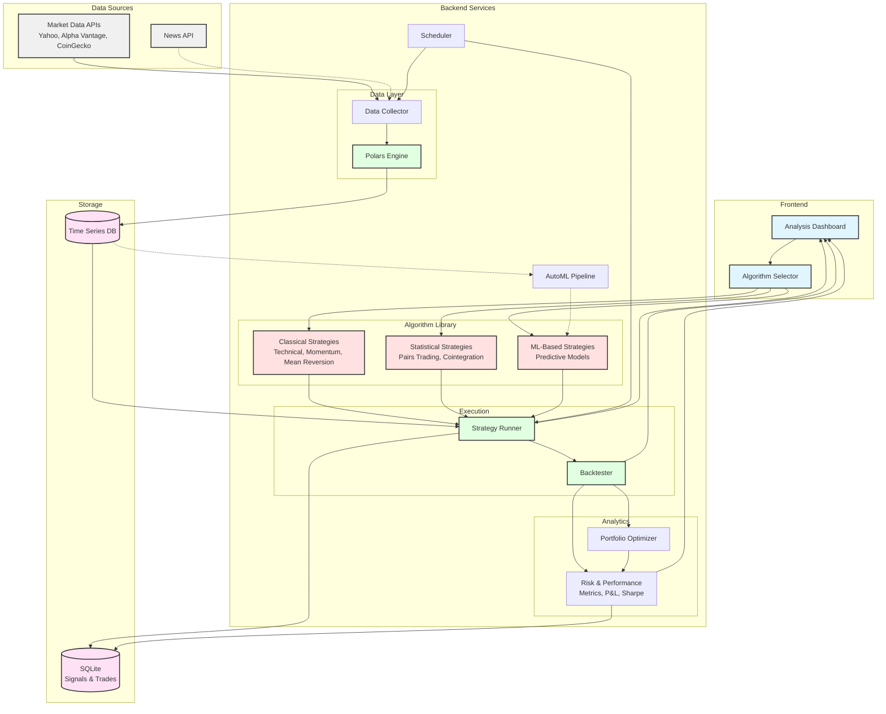

```mermaid
flowchart TB
    subgraph Frontend[Frontend]
        Dashboard[Analysis Dashboard]
        AlgoSelector[Algorithm Selector]
    end
    
    subgraph Backend[Backend Services]
        subgraph DataLayer[Data Layer]
            DataCollector[Data Collector]
            PolarsEngine[Polars Engine]
        end
        
        subgraph Algorithms[Algorithm Library]
            Classical[Classical Strategies<br/>Technical, Momentum, Mean Reversion]
            Statistical[Statistical Strategies<br/>Pairs Trading, Cointegration]
            MLBased[ML-Based Strategies<br/>Predictive Models]
        end
        
        subgraph Execution[Execution]
            StrategyRunner[Strategy Runner]
            Backtester[Backtester]
        end
        
        subgraph Analytics[Analytics]
            RiskAnalytics[Risk & Performance<br/>Metrics, P&L, Sharpe]
            PortfolioOpt[Portfolio Optimizer]
        end
        
        AutoML[AutoML Pipeline]
        Scheduler[Scheduler]
    end
    
    subgraph DataSources[Data Sources]
        MarketData[Market Data APIs<br/>Yahoo, Alpha Vantage, CoinGecko]
        NewsData[News API]
    end
    
    subgraph Storage[Storage]
        TimeSeriesDB[(Time Series DB)]
        SQLite[(SQLite<br/>Signals & Trades)]
    end
    
    %% Frontend flow
    Dashboard --> AlgoSelector
    AlgoSelector --> Classical
    AlgoSelector --> Statistical
    AlgoSelector --> MLBased
    
    %% Data ingestion
    MarketData --> DataCollector
    NewsData -.-> DataCollector
    DataCollector --> PolarsEngine
    PolarsEngine --> TimeSeriesDB
    
    %% Strategy execution
    Classical --> StrategyRunner
    Statistical --> StrategyRunner
    MLBased --> StrategyRunner
    
    TimeSeriesDB --> StrategyRunner
    StrategyRunner --> Backtester
    StrategyRunner --> SQLite
    
    %% Analytics
    Backtester --> PortfolioOpt
    Backtester --> RiskAnalytics
    PortfolioOpt --> RiskAnalytics
    RiskAnalytics --> SQLite
    
    %% AutoML (optional)
    TimeSeriesDB -.-> AutoML
    AutoML -.-> MLBased
    
    %% Results to dashboard
    RiskAnalytics --> Dashboard
    Backtester --> Dashboard
    StrategyRunner --> Dashboard
    
    %% Automation
    Scheduler --> DataCollector
    Scheduler --> StrategyRunner

    classDef frontend fill:#e1f5ff,stroke:#333,stroke-width:2px
    classDef algorithms fill:#ffe1e1,stroke:#333,stroke-width:2px
    classDef processing fill:#e1ffe1,stroke:#333,stroke-width:2px
    classDef storage fill:#ffe1f5,stroke:#333,stroke-width:2px
    classDef external fill:#f0f0f0,stroke:#333,stroke-width:2px
    
    class Dashboard,AlgoSelector frontend
    class Classical,Statistical,MLBased algorithms
    class StrategyRunner,PolarsEngine,Backtester processing
    class TimeSeriesDB,SQLite storage
    class MarketData,NewsData external
```