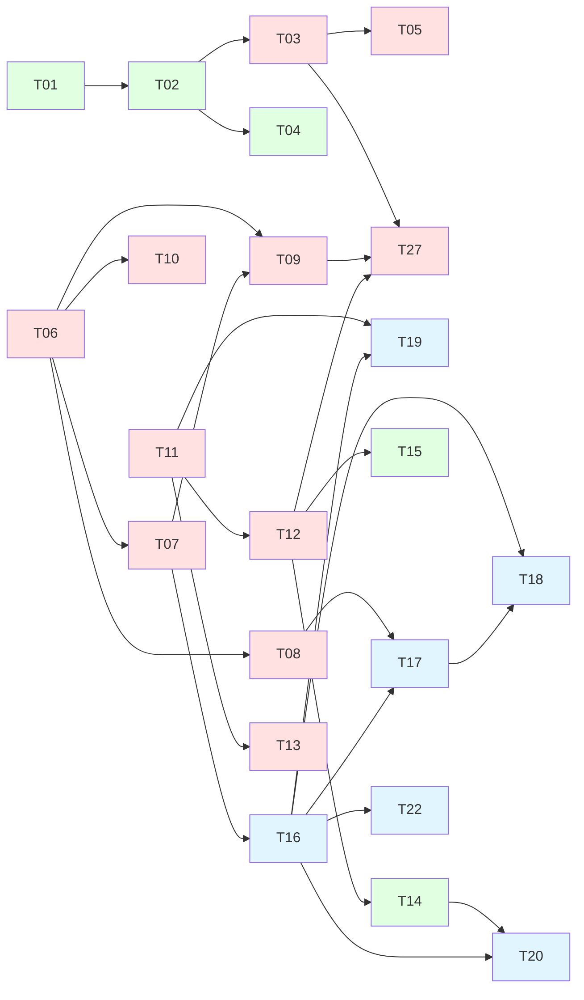
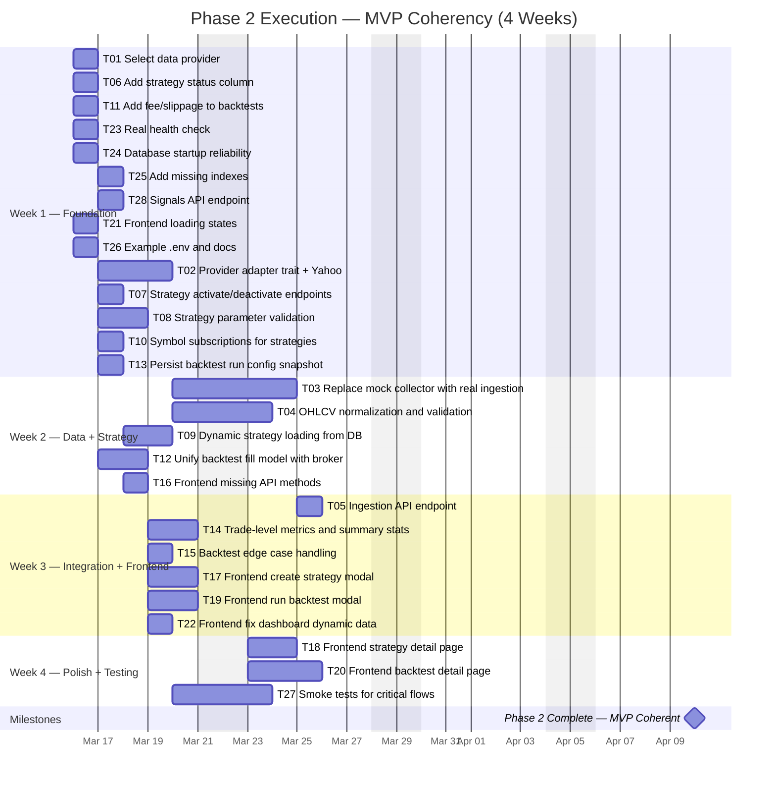

# Phase 2 Execution Plan — MVP Coherency

## Document Purpose

This is the **actionable execution plan** for completing Phase 2 of the Buffet project. It is based on the comprehensive code audit performed on 2026-03-16 and translates the strategic planning in `planning.md` into concrete engineering tasks with:

- precise task definitions scoped to specific files and modules
- acceptance criteria for every task
- dependency ordering
- effort estimates
- owner lane assignments (Backend, Frontend, Data, Platform)
- a detailed Gantt chart

---

## Current State Summary (from audit)

### What works today

| Area | Status | Details |
|---|---|---|
| Backend API (strategies) | ✅ Full CRUD | All 5 endpoints wired and functional |
| Backend API (orders) | ⚠️ Read-only | `GET /api/orders`, `GET /api/orders/{id}` only |
| Backend API (positions) | ⚠️ Read-only | `GET /api/positions`, `GET /api/positions/open`, `GET /api/positions/{id}` only |
| Backend API (backtests) | ✅ Create + Read | `POST`, `GET` list, `GET` by id, `GET` trades |
| Actor system | ✅ Scaffolded | All 5 actors compile, register, and handle messages |
| Data collection | 🔴 Mocked | Hardcoded single OHLCV candle, no real provider |
| Strategy engine | ⚠️ Minimal | One SMA strategy, no DB loading, no lifecycle |
| Backtest simulation | ⚠️ Prototype | Works end-to-end but no fees, no slippage, long-only, all-in sizing |
| Broker | ⚠️ Paper-only | `PaperBroker` with hardcoded `default_price = 100.0` |
| Frontend (dashboard) | ⚠️ Partial | Real data for orders/positions, hardcoded equity, placeholder chart |
| Frontend (strategies) | ⚠️ Read-only | Lists strategies, all buttons decorative |
| Frontend (backtests) | ⚠️ Read-only | Lists backtests, all buttons decorative |
| Frontend (forms) | 🔴 Missing | No create/edit/run forms exist |
| Frontend (detail pages) | 🔴 Missing | No detail views, no dynamic routes |
| Health check | ⚠️ Static | Returns `"OK"` without checking anything |
| Schema | ⚠️ Gaps | No `status` on strategies, no fee/slippage on backtests, missing indexes |
| Tests | ⚠️ Minimal | One strategy model test, one metrics test |

### Critical gaps blocking Phase 2 completion

1. **No real market data** — collector is entirely mocked
2. **No strategy lifecycle** — no active/inactive flag, no DB-driven loading
3. **No backtest configurability** — no fees, slippage, or position sizing params
4. **Backtest ↔ Broker disconnect** — backtest fills at raw `candle.close`, broker has slippage; these should be unified
5. **Frontend is read-only** — no create, edit, run, or detail flows
6. **No API methods in frontend** for create/update/delete
7. **Missing database indexes** on most tables
8. **Health check is fake**

---

## Task Breakdown

Tasks are organized into 5 workstreams matching `planning.md` section 2.1–2.5. Each task has:

- **ID**: for cross-referencing in the Gantt chart
- **Owner lane**: `BE` (Backend), `FE` (Frontend), `DATA` (Data/Quant), `PLAT` (Platform)
- **Effort**: in engineering days (1 person)
- **Dependencies**: task IDs that must complete first
- **Acceptance criteria**: concrete conditions to consider the task done

---

## Workstream 2.1 — Real End-to-End Data Flow

### T01 — Select and document primary market data provider
- **Owner**: DATA
- **Effort**: 1d
- **Dependencies**: none
- **Scope**: Evaluate Yahoo Finance (`yahoo_finance_api` crate already in `Cargo.toml`), Alpha Vantage, and CoinGecko. Pick one for MVP. Document the provider's rate limits, data format, historical depth, and symbol conventions.
- **Acceptance criteria**:
  - Decision documented in a `docs/data-provider.md` or equivalent
  - Rate limits, supported symbols, and OHLCV response schema are recorded
  - Team agrees on the choice

### T02 — Implement provider adapter trait and first adapter
- **Owner**: DATA
- **Effort**: 3d
- **Dependencies**: T01
- **Scope**: Create `src/providers/mod.rs` with a `MarketDataProvider` trait. Implement the first adapter (likely Yahoo via `yahoo_finance_api`). The adapter must:
  - Fetch daily OHLCV for a given symbol and date range
  - Normalize the response into `Vec<OHLCV>` with proper `DateTime<Utc>` timestamps
  - Handle HTTP errors, rate limits, and empty responses gracefully
- **Files to create/modify**:
  - `src/providers/mod.rs` (new — trait definition)
  - `src/providers/yahoo.rs` (new — Yahoo adapter)
  - `src/lib.rs` (add `pub mod providers`)
  - `Cargo.toml` (verify `yahoo_finance_api` and `reqwest` features)
- **Acceptance criteria**:
  - `YahooProvider::fetch_ohlcv("AAPL", start, end).await` returns valid `Vec<OHLCV>`
  - Timestamps are UTC, OHLCV fields are correct
  - Errors are returned as `Result`, not panics
  - At least one integration test that calls the real API (gated behind `#[ignore]` or a feature flag)

### T03 — Replace mock collector with real ingestion
- **Owner**: DATA / BE
- **Effort**: 3d
- **Dependencies**: T02
- **Scope**: Rewrite `DataCollectorActor`'s `CollectData` handler to use the provider adapter instead of hardcoded data. Add a `CollectHistorical` message for backfilling.
- **Files to modify**:
  - `src/actors/collector.rs`
  - `src/actors/messages.rs` (add `CollectHistorical` message)
- **Acceptance criteria**:
  - `CollectData { symbol: "AAPL" }` fetches real recent data from the provider
  - `CollectHistorical { symbol, start, end }` fetches and stores a date range
  - Data is stored in TimescaleDB via the storage actor
  - Data is forwarded to the strategy executor
  - Errors from the provider are logged and returned, not swallowed
  - No hardcoded OHLCV values remain

### T04 — Canonical OHLCV normalization and validation
- **Owner**: DATA
- **Effort**: 2d
- **Dependencies**: T02
- **Scope**: Add validation to ensure incoming OHLCV data is clean before storage. Create a normalization module.
- **Files to create/modify**:
  - `src/providers/normalize.rs` (new)
  - Validation rules: no negative prices, `high >= max(open, close)`, `low <= min(open, close)`, volume >= 0, timestamps are valid and in order, no duplicate timestamps
- **Acceptance criteria**:
  - `normalize_ohlcv(raw: Vec<OHLCV>) -> Result<Vec<OHLCV>, ValidationError>`
  - Invalid records are rejected with descriptive errors
  - Duplicates by timestamp are detected and deduplicated
  - Unit tests cover all validation rules

### T05 — Add ingestion API endpoint
- **Owner**: BE
- **Effort**: 1d
- **Dependencies**: T03
- **Scope**: Expose `POST /api/collect` endpoint that triggers data collection for a symbol. This allows the frontend (and later a scheduler) to trigger ingestion.
- **Files to create/modify**:
  - `src/routes/collect.rs` (new)
  - `src/handlers/collect.rs` (new)
  - `src/routes/mod.rs` (register new route)
  - `src/handlers/mod.rs` (register new handler module)
- **Acceptance criteria**:
  - `POST /api/collect { "symbol": "AAPL", "start": "...", "end": "..." }` triggers collection
  - Returns `202 Accepted` with a status message
  - Bad requests return `400`

---

## Workstream 2.2 — Strategy Lifecycle

### T06 — Add `status` column to strategies table
- **Owner**: BE
- **Effort**: 0.5d
- **Dependencies**: none
- **Scope**: Create a new migration adding `status TEXT NOT NULL DEFAULT 'inactive'` to the `strategies` table. Update the `Strategy` model and DTOs.
- **Files to create/modify**:
  - `migrations/20260316_add_strategy_status.sql` (new)
  - `src/models/strategy.rs` (add `status` field, update `CreateStrategyDto`, add `UpdateStatusDto`)
- **Acceptance criteria**:
  - Migration runs without error on existing databases
  - New strategies default to `inactive`
  - `Strategy` struct includes `status: String`
  - Valid statuses are: `active`, `inactive`, `error`

### T07 — Add strategy activation/deactivation endpoints
- **Owner**: BE
- **Effort**: 1d
- **Dependencies**: T06
- **Scope**: Add `PUT /api/strategies/{id}/activate` and `PUT /api/strategies/{id}/deactivate` endpoints. Add `GET /api/strategies?status=active` filtering.
- **Files to modify**:
  - `src/routes/strategy.rs`
  - `src/handlers/strategy.rs`
  - `src/models/strategy.rs`
- **Acceptance criteria**:
  - Activate sets `status = 'active'`, deactivate sets `status = 'inactive'`
  - `GET /api/strategies?status=active` returns only active strategies
  - Activating a non-existent strategy returns `404`
  - Activating an already-active strategy is idempotent (returns `200`)

### T08 — Strategy parameter validation
- **Owner**: BE
- **Effort**: 1.5d
- **Dependencies**: T06
- **Scope**: Validate strategy parameters against expected schema on create and update. Each `StrategyType` defines its required parameters.
- **Files to create/modify**:
  - `src/models/strategy.rs` (add `validate_parameters` function)
  - `src/handlers/strategy.rs` (call validation before create/update)
- **Acceptance criteria**:
  - `Classical` type requires `fast_period` (positive integer) and `slow_period` (positive integer), with `fast_period < slow_period`
  - Invalid parameters return `400 Bad Request` with a descriptive message
  - Valid parameters pass through unchanged
  - Unit tests for each strategy type's validation

### T09 — Dynamic strategy loading from database
- **Owner**: BE
- **Effort**: 2d
- **Dependencies**: T06, T07
- **Scope**: On startup and on activation, the `StrategyExecutorActor` should load active strategies from the database and register them. Add a `LoadStrategies` and `RegisterStrategy` / `UnregisterStrategy` message.
- **Files to modify**:
  - `src/actors/strategy.rs` (add messages and handlers)
  - `src/actors/messages.rs` (add new message types)
  - `src/main.rs` (trigger initial load after actor spawn)
- **Acceptance criteria**:
  - On startup, all strategies with `status = 'active'` are loaded and registered
  - When a strategy is activated via the API, a `RegisterStrategy` message is sent to the actor
  - When deactivated, `UnregisterStrategy` removes it from the active map
  - The strategy factory correctly maps `StrategyType::Classical` + parameters → `MovingAverageCrossover`
  - Unknown strategy types produce a clear error, not a panic

### T10 — Add symbol subscriptions to strategies
- **Owner**: BE
- **Effort**: 1d
- **Dependencies**: T06
- **Scope**: Add a `symbols` field (JSON array) to the strategy model. The executor should only apply each strategy to its subscribed symbols.
- **Files to modify**:
  - `migrations/20260316_add_strategy_symbols.sql` (new — add `symbols TEXT DEFAULT '[]'`)
  - `src/models/strategy.rs`
  - `src/actors/strategy.rs` (filter by symbol in `MarketDataUpdate` handler)
- **Acceptance criteria**:
  - Strategies have a `symbols: Vec<String>` field (stored as JSON)
  - `MarketDataUpdate` for `"AAPL"` only triggers strategies subscribed to `"AAPL"`
  - Strategies with an empty `symbols` list receive all symbols (wildcard behavior)
  - Parameter is included in create/update DTOs

---

## Workstream 2.3 — Backtest Baseline Quality

### T11 — Add fee and slippage configuration to backtests
- **Owner**: BE
- **Effort**: 1d
- **Dependencies**: none
- **Scope**: Add `commission_rate` and `slippage_bps` columns to the `backtests` table. Accept them in `CreateBacktestDto`.
- **Files to create/modify**:
  - `migrations/20260316_add_backtest_config.sql` (new)
  - `src/models/backtest.rs` (add fields, update DTOs)
- **Acceptance criteria**:
  - New backtests accept optional `commission_rate` (default `0.001` = 0.1%) and `slippage_bps` (default `10`)
  - Values are persisted and readable
  - Existing backtests are not broken (columns are nullable or have defaults)

### T12 — Unify backtest fill model with broker abstraction
- **Owner**: BE / DATA
- **Effort**: 2d
- **Dependencies**: T11
- **Scope**: Refactor the `BacktestActor` simulation to use a `BacktestBroker` that implements the `Broker` trait, applying fees and slippage from the backtest config instead of inline fill logic.
- **Files to create/modify**:
  - `src/broker/backtest.rs` (new — `BacktestBroker` implementing `Broker`)
  - `src/broker/mod.rs` (export new broker)
  - `src/actors/backtest.rs` (use `BacktestBroker` instead of inline fills)
- **Acceptance criteria**:
  - `BacktestBroker` takes `commission_rate` and `slippage_bps` as constructor args
  - `BacktestBroker` takes a `current_price: f64` method or field to use the candle close
  - Fill price = `candle.close * (1 + slippage)` for buys, `candle.close * (1 - slippage)` for sells
  - Commission deducted from balance on each trade
  - Backtest results now differ from zero-cost results (verified by test)
  - `PaperBroker` and `BacktestBroker` both implement the same `Broker` trait

### T13 — Persist backtest run configuration snapshot
- **Owner**: BE
- **Effort**: 1d
- **Dependencies**: T11
- **Scope**: When a backtest starts, snapshot the strategy parameters, fee/slippage settings, and provider info into a `run_config` JSON column so results are always explainable.
- **Files to modify**:
  - `migrations/20260316_add_backtest_config.sql` (add `run_config TEXT` column in same migration as T11)
  - `src/models/backtest.rs`
  - `src/actors/backtest.rs` (persist config at start of run)
- **Acceptance criteria**:
  - `backtests.run_config` contains a JSON object with: strategy name, strategy type, strategy parameters, commission rate, slippage bps, symbol, start/end times
  - The field is populated before the simulation starts
  - Readable from the `GET /api/backtests/{id}` response

### T14 — Add trade-level metrics and basic summary stats
- **Owner**: DATA
- **Effort**: 1.5d
- **Dependencies**: T12
- **Scope**: After simulation, calculate and persist summary stats: trade count, win rate, profit factor, average trade return. Add to `update_results`.
- **Files to modify**:
  - `src/utils/metrics.rs` (add new calculation functions)
  - `src/actors/backtest.rs` (compute and persist new metrics)
  - `migrations/20260316_add_backtest_config.sql` (add `trade_count`, `win_rate`, `profit_factor` columns)
  - `src/models/backtest.rs` (add fields)
- **Acceptance criteria**:
  - `trade_count`: number of round-trip trades
  - `win_rate`: fraction of trades with positive PnL
  - `profit_factor`: gross profits / gross losses (or `f64::INFINITY` if no losses)
  - All values persisted in the `backtests` table
  - Returned in `GET /api/backtests/{id}`
  - Unit tests for each metric function

### T15 — Improve backtest determinism and edge case handling
- **Owner**: DATA
- **Effort**: 1d
- **Dependencies**: T12
- **Scope**: Handle edge cases in the simulation loop cleanly.
- **Files to modify**:
  - `src/actors/backtest.rs`
- **Acceptance criteria**:
  - If there are fewer data points than the strategy's lookback period, the backtest completes with a warning, not an error
  - If the simulation ends with an open position, it is closed at the last candle's close price
  - The `returns` vector is correctly populated even when only one trade occurs
  - A backtest with zero trades completes successfully with `total_return = 0`, `sharpe = 0`, `mdd = 0`

---

## Workstream 2.4 — Frontend MVP Completion

### T16 — Add missing API service methods
- **Owner**: FE
- **Effort**: 1d
- **Dependencies**: T07
- **Scope**: Add `create_strategy`, `update_strategy`, `delete_strategy`, `activate_strategy`, `deactivate_strategy`, `get_backtest`, `collect_data` to `ApiService`.
- **Files to modify**:
  - `src/services/api.rs`
- **Acceptance criteria**:
  - All methods handle success and error responses
  - DTOs match backend expectations
  - Methods are available for use in pages

### T17 — Create strategy form / modal
- **Owner**: FE
- **Effort**: 2d
- **Dependencies**: T16, T08
- **Scope**: Add a modal or page for creating a new strategy. Fields: name, strategy type (dropdown), parameters (dynamic form based on type), symbols (multi-input).
- **Files to create/modify**:
  - `src/components/create_strategy_modal.rs` (new)
  - `src/components/mod.rs` (export)
  - `src/pages/strategies.rs` (wire "New Strategy" button to modal)
- **Acceptance criteria**:
  - Modal opens when "New Strategy" button is clicked
  - Form validates required fields client-side
  - On submit, calls `ApiService::create_strategy()`
  - On success, strategy list refreshes and modal closes
  - On error, error message is displayed in the modal
  - Classical type shows `fast_period` and `slow_period` inputs

### T18 — Strategy detail / configuration page
- **Owner**: FE
- **Effort**: 2d
- **Dependencies**: T16, T17
- **Scope**: Add a strategy detail page at `/strategies/{id}` showing configuration, status, and actions.
- **Files to create/modify**:
  - `src/pages/strategy_detail.rs` (new)
  - `src/pages/mod.rs` (export)
  - `src/routes.rs` (add `StrategyDetail { id }` route)
  - `src/app.rs` (add switch case)
- **Acceptance criteria**:
  - Shows strategy name, type, parameters, status, created/updated dates
  - "Activate" / "Deactivate" button works and updates status
  - "Edit" button opens edit form (reuse create modal in edit mode)
  - "Delete" button with confirmation dialog
  - "Configure" button on strategies list page links here
  - Link to run a backtest for this strategy

### T19 — Run backtest form / modal
- **Owner**: FE
- **Effort**: 2d
- **Dependencies**: T16, T11
- **Scope**: Add a modal for running a new backtest. Fields: strategy (dropdown or pre-selected from strategy page), symbol, start date, end date, initial balance, commission rate, slippage bps.
- **Files to create/modify**:
  - `src/components/run_backtest_modal.rs` (new)
  - `src/components/mod.rs` (export)
  - `src/pages/strategies.rs` (wire "Run" button)
  - `src/pages/backtests.rs` (wire "New Backtest" button)
- **Acceptance criteria**:
  - Modal opens from both "Run" on strategy card and "New Backtest" on backtests page
  - If opened from a strategy card, strategy is pre-selected
  - Date pickers for start/end (HTML date inputs are fine for MVP)
  - On submit, calls `ApiService::run_backtest()`
  - On success, navigates to backtests list (or detail page if available)
  - On error, shows error message

### T20 — Backtest detail page
- **Owner**: FE
- **Effort**: 2.5d
- **Dependencies**: T16, T14
- **Scope**: Add a backtest detail page at `/backtests/{id}` showing full results, metrics, and trade list.
- **Files to create/modify**:
  - `src/pages/backtest_detail.rs` (new)
  - `src/pages/mod.rs` (export)
  - `src/routes.rs` (add `BacktestDetail { id }` route)
  - `src/app.rs` (add switch case)
  - `src/services/api.rs` (add `get_backtest_trades` method)
- **Acceptance criteria**:
  - Shows all backtest metadata: strategy, symbol, dates, status, initial/final balance
  - Shows all metrics: total return, Sharpe, max drawdown, trade count, win rate, profit factor
  - Shows run configuration (fees, slippage, strategy params)
  - Lists all trades in a table: side, entry/exit price, entry/exit time, PnL, % return
  - "View Details" button on backtests list links here
  - Loading and error states are handled

### T21 — Add loading states across all pages
- **Owner**: FE
- **Effort**: 1d
- **Dependencies**: none
- **Scope**: Add a loading spinner or skeleton component and use it in dashboard, strategies, and backtests pages while API calls are in flight.
- **Files to create/modify**:
  - `src/components/loading.rs` (new — simple spinner component)
  - `src/components/mod.rs` (export)
  - `src/pages/dashboard.rs`
  - `src/pages/strategies.rs`
  - `src/pages/backtests.rs`
- **Acceptance criteria**:
  - All pages show a spinner/skeleton during initial data load
  - Spinner disappears when data arrives or error occurs
  - Spinner is visually consistent with the dark theme

### T22 — Fix dashboard dynamic data
- **Owner**: FE
- **Effort**: 1d
- **Dependencies**: T16
- **Scope**: Replace hardcoded "Total Equity" with a computed value. Improve the stats cards with real calculations.
- **Files to modify**:
  - `src/pages/dashboard.rs`
- **Acceptance criteria**:
  - "Total Equity" sums positions' `avg_entry_price * quantity` + available balance (or just total position value for MVP)
  - All stat card `change` fields display actual data or are removed if no comparison data exists
  - Strategy count is displayed (requires fetching strategies)

---

## Workstream 2.5 — Operational Consistency

### T23 — Real health check
- **Owner**: BE
- **Effort**: 0.5d
- **Dependencies**: none
- **Scope**: Make `GET /health` actually verify system readiness.
- **Files to modify**:
  - `src/routes/health.rs`
- **Acceptance criteria**:
  - Health check pings SQLite with `SELECT 1`
  - Health check pings Postgres with `SELECT 1`
  - Returns `200 { "status": "ok", "sqlite": "ok", "tsdb": "ok" }` when healthy
  - Returns `503 { "status": "degraded", ... }` when any dependency is unreachable
  - Response time is under 2 seconds

### T24 — Database startup reliability
- **Owner**: BE
- **Effort**: 1d
- **Dependencies**: none
- **Scope**: Ensure the startup sequence is robust: run migrations, set up TSDB tables, enable foreign keys.
- **Files to modify**:
  - `src/db.rs` (add `PRAGMA foreign_keys = ON` after connect)
  - `src/main.rs` (call `tsdb.setup()` on startup)
- **Acceptance criteria**:
  - `PRAGMA foreign_keys = ON` is executed on every SQLite connection
  - TSDB `setup()` is called during startup (creates `ohlcv` table and attempts hypertable)
  - If TSDB is unreachable, startup fails with a clear error message
  - If SQLite migration fails, startup fails with a clear error message

### T25 — Add missing database indexes
- **Owner**: BE
- **Effort**: 0.5d
- **Dependencies**: none
- **Scope**: Add indexes for common query patterns.
- **Files to create**:
  - `migrations/20260316_add_indexes.sql` (new)
- **Acceptance criteria**:
  - Indexes added for:
    - `signals(strategy_id)`
    - `signals(symbol, timestamp)`
    - `orders(status)`
    - `orders(symbol)`
    - `orders(created_at)`
    - `positions(symbol, side, status)` — used by `open_or_update`
    - `backtests(strategy_id)`
    - `backtests(status)`
    - `backtest_trades(backtest_id)`
  - Migration runs without error on existing databases

### T26 — Add example `.env` and setup documentation
- **Owner**: PLAT
- **Effort**: 0.5d
- **Dependencies**: none
- **Scope**: Add a `.env.example` file and a `README.md` or `docs/setup.md` with local development instructions.
- **Files to create**:
  - `.env.example` (new)
  - `docs/setup.md` (new)
- **Acceptance criteria**:
  - `.env.example` contains all required and optional environment variables with comments
  - Setup doc covers: prerequisites, database setup, building, running, and first-use steps
  - A new developer can go from clone to running in under 15 minutes following the doc

### T27 — Smoke tests for critical flows
- **Owner**: BE
- **Effort**: 2d
- **Dependencies**: T03, T09, T12
- **Scope**: Add integration tests that verify the core flows work end-to-end against a real SQLite database (in-memory).
- **Files to create**:
  - `tests/strategy_lifecycle.rs` (new)
  - `tests/backtest_flow.rs` (new)
- **Acceptance criteria**:
  - Test: create strategy → activate → verify it's in active list
  - Test: create strategy → create backtest → verify backtest completes (with mock TSDB data)
  - Test: strategy CRUD roundtrip (create, read, update, delete)
  - Test: health check returns 200
  - All tests pass in CI with `cargo test`

### T28 — Signals API endpoint
- **Owner**: BE
- **Effort**: 0.5d
- **Dependencies**: none
- **Scope**: The signals table exists and model has CRUD, but there are no routes or handlers. Add read-only endpoints so the frontend can display signal history.
- **Files to create/modify**:
  - `src/routes/signal.rs` (new)
  - `src/handlers/signal.rs` (new)
  - `src/handlers/mod.rs` (add module)
  - `src/routes/mod.rs` (merge signal routes)
- **Acceptance criteria**:
  - `GET /api/signals` returns all signals (ordered by `created_at DESC`)
  - `GET /api/signals?strategy_id={id}` returns signals for a specific strategy
  - `GET /api/signals/{id}` returns a single signal

---

## Task Summary Table

| ID | Task | Owner | Effort | Dependencies | Workstream |
|---|---|---|---:|---|---|
| T01 | Select primary data provider | DATA | 1d | — | 2.1 |
| T02 | Provider adapter trait + first adapter | DATA | 3d | T01 | 2.1 |
| T03 | Replace mock collector with real ingestion | DATA/BE | 3d | T02 | 2.1 |
| T04 | OHLCV normalization and validation | DATA | 2d | T02 | 2.1 |
| T05 | Ingestion API endpoint | BE | 1d | T03 | 2.1 |
| T06 | Add `status` column to strategies | BE | 0.5d | — | 2.2 |
| T07 | Strategy activation/deactivation endpoints | BE | 1d | T06 | 2.2 |
| T08 | Strategy parameter validation | BE | 1.5d | T06 | 2.2 |
| T09 | Dynamic strategy loading from DB | BE | 2d | T06, T07 | 2.2 |
| T10 | Symbol subscriptions for strategies | BE | 1d | T06 | 2.2 |
| T11 | Fee/slippage config on backtests | BE | 1d | — | 2.3 |
| T12 | Unify backtest fill model with broker | BE/DATA | 2d | T11 | 2.3 |
| T13 | Persist backtest run config snapshot | BE | 1d | T11 | 2.3 |
| T14 | Trade-level metrics and summary stats | DATA | 1.5d | T12 | 2.3 |
| T15 | Backtest edge case handling | DATA | 1d | T12 | 2.3 |
| T16 | Frontend: missing API service methods | FE | 1d | T07 | 2.4 |
| T17 | Frontend: create strategy form/modal | FE | 2d | T16, T08 | 2.4 |
| T18 | Frontend: strategy detail page | FE | 2d | T16, T17 | 2.4 |
| T19 | Frontend: run backtest form/modal | FE | 2d | T16, T11 | 2.4 |
| T20 | Frontend: backtest detail page | FE | 2.5d | T16, T14 | 2.4 |
| T21 | Frontend: loading states | FE | 1d | — | 2.4 |
| T22 | Frontend: fix dashboard dynamic data | FE | 1d | T16 | 2.4 |
| T23 | Real health check | BE | 0.5d | — | 2.5 |
| T24 | Database startup reliability | BE | 1d | — | 2.5 |
| T25 | Add missing database indexes | BE | 0.5d | — | 2.5 |
| T26 | Example `.env` and setup docs | PLAT | 0.5d | — | 2.5 |
| T27 | Smoke tests for critical flows | BE | 2d | T03, T09, T12 | 2.5 |
| T28 | Signals API endpoint | BE | 0.5d | — | 2.5 |
| | **Total** | | **38d** | | |

---

## Dependency Graph

---

## Detailed Gantt Chart

This Gantt chart shows the 4-week execution plan with parallel lanes. It accounts for the dependency graph above and parallelizes independent work across Backend, Data, Frontend, and Platform lanes.

---

## Week-by-Week Execution Guide

### Week 1 (Mar 16–20): Foundation & Quick Wins

**Goal**: Get all schema changes, quick infrastructure fixes, and provider selection done. Unblock the main dependency chains.

| Day | Backend | Data | Frontend | Platform |
|---|---|---|---|---|
| Mon | T06 strategy status migration, T23 health check, T24 DB startup | T01 provider selection | T21 loading spinner component | T26 env + docs |
| Tue | T25 indexes, T28 signals API, T07 activate/deactivate | T02 provider trait + Yahoo adapter (start) | T21 integrate spinners into pages | — |
| Wed | T08 parameter validation (start), T10 symbol subscriptions | T02 adapter (continue) | — | — |
| Thu | T08 validation (finish), T13 run config snapshot | T02 adapter (finish) | — | — |
| Fri | T11 fee/slippage migration | T04 normalization (start) | — | — |

**End of week 1 deliverables**:
- Strategy status column, indexes, signals API, health check, DB startup — all merged
- Provider adapter trait + Yahoo adapter — PR ready
- Strategy activation endpoints — merged
- Fee/slippage config on backtests — merged
- Frontend has loading states
- `.env.example` and setup docs exist

---

### Week 2 (Mar 23–27): Data Integration & Strategy Lifecycle

**Goal**: Real data flowing through the system. Strategy lifecycle operational. Backtest fill model unified.

| Day | Backend | Data | Frontend | Platform |
|---|---|---|---|---|
| Mon | T09 dynamic strategy loading (start) | T03 real collector (start), T04 normalization (finish) | T16 API service methods | — |
| Tue | T09 loading (finish) | T03 collector (continue) | — | — |
| Wed | T12 backtest fill unification (start) | T03 collector (finish) | — | — |
| Thu | T12 fill unification (finish) | — | — | — |
| Fri | — | — | — | — |

**End of week 2 deliverables**:
- `DataCollectorActor` fetches real data from Yahoo
- OHLCV validation and normalization is in place
- Strategies load from DB on startup, activate/deactivate at runtime
- Backtests apply fees and slippage via `BacktestBroker`
- Frontend API service has all needed methods

---

### Week 3 (Mar 30–Apr 3): Integration & Frontend Features

**Goal**: All backend features are complete. Frontend gets create/run flows.

| Day | Backend | Data | Frontend | Platform |
|---|---|---|---|---|
| Mon | T05 ingestion endpoint | T14 trade-level metrics (start) | T17 create strategy modal (start) | — |
| Tue | — | T14 metrics (finish), T15 edge cases | T17 modal (finish), T22 dashboard fix | — |
| Wed | — | — | T19 run backtest modal (start) | — |
| Thu | — | — | T19 modal (finish) | — |
| Fri | — | — | — | — |

**End of week 3 deliverables**:
- Ingestion API endpoint works
- Backtests compute and persist trade count, win rate, profit factor
- Edge cases handled (zero trades, open position at end, insufficient data)
- Users can create strategies from the frontend
- Users can run backtests from the frontend
- Dashboard stats are dynamic

---

### Week 4 (Apr 6–10): Detail Pages, Testing & Polish

**Goal**: Frontend detail views. Integration tests. Phase 2 complete.

| Day | Backend | Data | Frontend | Platform |
|---|---|---|---|---|
| Mon | T27 smoke tests (start) | — | T18 strategy detail page (start) | — |
| Tue | T27 smoke tests (finish) | — | T18 strategy detail (finish) | — |
| Wed | — | — | T20 backtest detail page (start) | — |
| Thu | — | — | T20 detail (continue) | — |
| Fri | Bug fixes and polish | Bug fixes and polish | T20 detail (finish) | — |

**End of week 4 deliverables**:
- Strategy detail page with activate/deactivate/edit/delete
- Backtest detail page with full metrics and trade list
- Integration tests pass for strategy lifecycle, backtest flow, CRUD, health
- All Phase 2 exit criteria met

---

## Exit Criteria Checklist

Phase 2 is complete when all of the following are true:

### Data flow
- [ ] At least one real market data provider is integrated (T02, T03)
- [ ] OHLCV data is validated before storage (T04)
- [ ] Data collection can be triggered via API (T05)
- [ ] No hardcoded mock data remains in the collector (T03)

### Strategy lifecycle
- [ ] Strategies have an `active`/`inactive` status (T06)
- [ ] Strategies can be activated and deactivated via API (T07)
- [ ] Strategy parameters are validated on create/update (T08)
- [ ] Active strategies are loaded from DB on startup (T09)
- [ ] Strategies can be scoped to specific symbols (T10)

### Backtesting
- [ ] Backtests accept fee and slippage configuration (T11)
- [ ] Backtest fills use the broker abstraction with fees/slippage (T12)
- [ ] Backtest run configuration is snapshotted and persisted (T13)
- [ ] Trade count, win rate, and profit factor are computed and stored (T14)
- [ ] Edge cases (zero trades, open position, insufficient data) are handled (T15)

### Frontend
- [ ] Users can create a new strategy via the UI (T17)
- [ ] Users can view strategy details and manage lifecycle (T18)
- [ ] Users can run a backtest with configurable parameters (T19)
- [ ] Users can view full backtest results and trade list (T20)
- [ ] All pages have loading states (T21)
- [ ] Dashboard shows dynamic, real data (T22)

### Operations
- [ ] Health check verifies database connectivity (T23)
- [ ] Database startup is reliable with foreign keys enabled (T24)
- [ ] Common query paths have indexes (T25)
- [ ] `.env.example` and setup documentation exist (T26)
- [ ] Integration tests cover critical flows (T27)
- [ ] Signals are readable via API (T28)

---

## Risk Register (Phase 2 specific)

| Risk | Impact | Likelihood | Mitigation |
|---|---|---|---|
| Yahoo Finance API changes or rate-limits aggressively | Blocks data ingestion | Medium | Have Alpha Vantage as backup; cache aggressively; add retry with backoff |
| TimescaleDB not available in dev environment | Blocks backtest testing | Low | TSDB setup falls back to plain Postgres tables gracefully (already coded) |
| Yew framework limitations for forms/modals | Slows frontend work | Medium | Keep forms simple (no complex multi-step wizards); use native HTML inputs |
| Strategy parameter schema becomes complex | Scope creep in T08 | Medium | Only validate `Classical` for MVP; other types return a generic "unsupported" |
| Integration tests flaky due to external API calls | CI unreliability | Medium | Gate external API tests behind `#[ignore]`; use recorded/mock responses for CI |

---

## Post-Phase 2 Transition

Once all exit criteria are met, the project transitions to **Phase 3 — Data and Analytics Maturity**. The key handoff items are:

1. The provider adapter trait is ready for additional providers (Alpha Vantage, CoinGecko)
2. The broker trait is unified and ready for more realistic fill models
3. The strategy trait is ready for statistical and ML implementations
4. The frontend component architecture supports new pages and modals
5. The testing infrastructure supports adding integration tests incrementally

The Gantt chart in `planning.md` picks up at **Milestone A — MVP Complete** (2026-04-24, with buffer) and continues into Phase 3 workstreams.