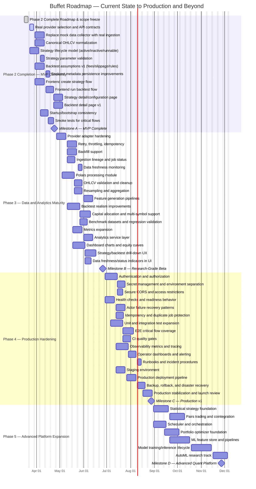

# Buffet Production Planning Roadmap

## Purpose

This document translates the target architecture in `ARCH.md` into a practical delivery roadmap. It identifies:

- the phases of the project
- the current phase
- the work required to reach production readiness
- approximate effort and timelines
- major milestones, risks, and dependencies

This plan assumes the current system is a **working early MVP** with:

- a Rust backend
- a Rust/Yew frontend
- SQLite for operational metadata
- PostgreSQL/Timescale-style time-series storage abstraction
- actor-based internal workflow
- initial strategy execution and backtesting scaffolding
- basic dashboard, strategy, and backtest pages

---

# Executive Summary

## Current phase

The project is currently in:

> **Phase 2 — Vertical MVP / Core Platform Assembly**

That means the core shape of the system exists, but several architecture components are still incomplete, stubbed, or not yet production-hardened.

### Already present

- frontend shell with dashboard/strategies/backtests
- backend API routes for strategies, orders, positions, backtests
- SQLite persistence for strategies, signals, orders, positions, backtests
- actor system for collection, execution, storage, and backtesting
- time-series database abstraction
- initial classical strategy support
- basic backtest simulation and metric calculation
- paper broker abstraction

### Still missing for production

- real market data ingestion
- robust data normalization and quality handling
- fully implemented Polars-based data pipeline
- richer strategy library
- statistical and ML strategy implementations
- portfolio optimization
- real analytics and monitoring
- scheduling and orchestration
- auth, security, tenancy, and operational hardening
- testing depth and deployment automation
- production-grade observability and incident response

---

# Planning Assumptions

## Team assumptions

Effort and timelines below assume a small focused team such as:

- **1 product-minded technical lead / architect**
- **1–2 backend engineers**
- **1 frontend engineer**
- **1 data/quant engineer**
- optionally **1 DevOps / platform engineer** part-time

Equivalent capacity: roughly **3–5 full-time people**.

## Time assumptions

Timelines are approximate and assume:

- disciplined scope control
- no major rewrites
- external APIs are available and stable
- production means a reliable first release, not a fully mature institutional-grade trading platform

## Effort scale

Each phase includes rough effort in:

- **Engineering weeks**: cumulative person-weeks
- **Calendar time**: elapsed duration assuming parallel work by a small team

---

# Target End State

To consider Buffet "production-ready," the system should support:

- reliable and repeatable market data ingestion
- durable time-series storage and query behavior
- configurable strategy lifecycle management
- accurate and explainable backtesting
- robust paper trading and optionally broker integration
- useful dashboarding and analytics
- operational safety, monitoring, alerting, and rollback
- secure deployment with secrets handling and environment separation
- documented runbooks and ownership model

---

# Phase Overview

| Phase | Name | Goal | Estimated Engineering Effort | Estimated Calendar Time |
|---|---|---|---:|---:|
| 0 | Architecture Clarification and Baseline | Lock scope, standards, environments | 2–4 weeks | 1–2 weeks |
| 1 | Foundation | Core app, storage, routes, models | 6–10 weeks | 3–5 weeks |
| 2 | Vertical MVP | End-to-end basic strategy/backtest flow | 8–14 weeks | 4–8 weeks |
| 3 | Data and Analytics Maturity | Real ingestion, robust backtests, analytics | 14–24 weeks | 8–12 weeks |
| 4 | Production Hardening | Reliability, security, testing, operations | 12–20 weeks | 6–10 weeks |
| 5 | Advanced Platform Expansion | Statistical/ML/optimization/autonomy | 16–36 weeks | 10–20 weeks |

## Current state by phase

- **Phase 0**: mostly complete
- **Phase 1**: substantially complete
- **Phase 2**: in progress / largely reached
- **Phase 3**: not complete
- **Phase 4**: not complete
- **Phase 5**: mostly future roadmap

---

# Detailed Gantt Chart

The following Gantt chart provides a detailed 24-week roadmap from the current project state to a first production release, followed by post-production advanced platform expansion. It is designed for a small team working in parallel across backend, frontend, data/quant, and platform concerns.

## Gantt Chart Notes

### Schedule basis
- The chart assumes work starts from the current roadmap date and runs on a 5-day engineering week.
- Several streams intentionally overlap because backend, frontend, data, and platform work can proceed in parallel.
- Milestones are conservative checkpoints, not guarantees.

### Critical path to production
The most important chain for reaching Production v1 is:

1. real provider integration
2. canonical ingestion and storage reliability
3. strategy lifecycle and backtest credibility improvements
4. dashboard and workflow completion
5. authentication, testing, CI/CD, and observability
6. staging, production deployment, and stabilization

### Parallelizable work
The following workstreams should run in parallel wherever possible:
- frontend UX work alongside backend API completion
- Polars/data processing alongside ingestion hardening
- analytics expansion alongside dashboard UI work
- observability and deployment preparation alongside testing expansion

### Highest-risk schedule items
The tasks most likely to affect the schedule are:
- external provider integration and rate limiting
- data normalization and backfill handling
- backtest fidelity changes that alter existing assumptions
- authentication and environment separation
- CI/CD, production deployment, and rollback readiness

### Recommended milestone interpretation
- **Milestone A**: MVP coherence achieved
- **Milestone B**: research-grade beta achieved
- **Milestone C**: first production-ready release
- **Milestone D**: advanced quant expansion begins to mature

---

# Phase 0 — Architecture Clarification and Baseline

## Objective

Turn the conceptual architecture into a concrete implementation plan with clear boundaries, interfaces, and operating assumptions.

## Status

**Mostly complete**, but some important clarifications should still be documented more explicitly.

## Key deliverables

- architecture diagram and system decomposition
- technology choices for frontend/backend/storage
- first-cut database schema
- internal actor/message boundaries
- repository structure
- naming and coding conventions
- environment strategy: local, staging, production

## Remaining tasks

### Product and scope clarification
- define supported asset classes for v1
- define supported data providers for v1
- define whether production means paper trading only or live broker support
- define initial user model: single-user, internal-only, or multi-user
- define strategy configuration and parameter standards

### Technical clarification
- document ownership of SQLite vs Postgres/Timescale data
- define canonical OHLCV schema and time conventions
- define strategy lifecycle state transitions
- define backtest assumptions:
  - fees
  - slippage
  - order model
  - capital constraints
  - fill rules

## Estimated effort
- **2–4 engineering weeks**
- **1–2 calendar weeks**

## Exit criteria
- roadmap approved
- v1 scope frozen
- production definition agreed
- major architectural unknowns documented

---

# Phase 1 — Foundation

## Objective

Establish the fundamental project skeleton: backend app, frontend app, database models, migrations, routing, and baseline infrastructure.

## Status

**Substantially complete**

## Completed or mostly completed areas

- backend crate and app bootstrap
- frontend crate and application shell
- migrations for core metadata tables
- route organization
- model layer for strategies, orders, positions, backtests
- application state and actor registration
- initial telemetry/logging setup

## Gaps to close retroactively

Even if Phase 1 is effectively complete, some foundation work should still be tightened before production.

### Tasks

#### Repository and developer workflow
- add root-level development documentation
- standardize commands for local setup
- document required environment variables
- add example env files
- define formatting, linting, and test commands
- document database bootstrap steps

#### Configuration
- separate config per environment
- validate all required environment variables on startup
- define sane defaults for local development only
- centralize feature flags

#### Data ownership and schema hygiene
- review all migrations for naming consistency
- ensure foreign key relationships are explicit where appropriate
- add indexes for common query paths
- add schema documentation

#### Error handling baseline
- standardize API error responses
- define internal error taxonomy
- document recoverable vs fatal failures

## Estimated effort
- **6–10 engineering weeks total historically**
- **remaining cleanup: 1–2 calendar weeks**

## Exit criteria
- reproducible local setup
- cleanly documented configuration
- migration strategy stable
- clear schema ownership

---

# Phase 2 — Vertical MVP / Core Platform Assembly

## Objective

Deliver a minimal end-to-end vertical slice from strategy definition to storage, execution, backtesting, and UI display.

## Status

> **Current phase**

This phase is the project's present state.

## What exists already

### Backend
- strategy CRUD endpoints
- order and position read endpoints
- backtest creation and retrieval endpoints
- actor-driven service composition
- backtest actor that runs simulations
- paper broker abstraction for simulated fills

### Storage
- SQLite operational data models
- Postgres/Timescale-like abstraction for OHLCV
- insert/query support for time-series data

### Frontend
- dashboard page
- strategies page
- backtests page
- API service for fetching domain data

### Domain logic
- simple classical strategy path
- signal generation scaffold
- order creation and position updates
- backtest metrics including total return, Sharpe, and max drawdown

## Why this phase is not complete enough for production

The MVP is structurally valid, but much of it is still simplified:

- data collection uses mock data
- strategy support is narrow
- charts and UX are placeholders
- execution is prototype-grade
- analytics are minimal
- scheduler and automation are absent
- test coverage and production safety are limited

## Remaining tasks to fully complete Phase 2

### 2.1 Real end-to-end data flow
- replace mock collector path with real market data ingestion
- support at least one reliable market data provider first
- normalize provider responses into canonical OHLCV
- validate timestamp, symbol, and timezone handling
- persist and verify ingested data

### 2.2 Strategy lifecycle
- load strategies dynamically from storage
- define strategy activation/deactivation behavior
- support strategy parameter validation
- define symbol subscriptions and market coverage
- ensure strategy executor only runs configured active strategies

### 2.3 Backtest baseline quality
- add explicit fees/slippage assumptions
- ensure backtests use realistic price references
- persist detailed run metadata
- define deterministic simulation rules
- record input parameters used during each backtest

### 2.4 Frontend MVP completion
- connect create strategy flows
- connect run strategy / run backtest actions
- add backtest detail view
- add strategy detail/configuration view
- improve loading and error states
- display core metrics in a usable format

### 2.5 Operational consistency
- define startup sequence for backend services
- ensure database and time-series setup are executed reliably
- validate first-run developer setup
- add smoke tests for critical flows

## Estimated effort
- **8–14 engineering weeks total historically**
- **remaining effort to finish the phase properly: 3–5 calendar weeks**

## Exit criteria
- one real data provider integrated
- one classical strategy fully configurable and executable
- one complete backtest workflow reliable end-to-end
- UI supports key user flows beyond read-only display
- smoke-tested local and staging environments

---

# Phase 3 — Data and Analytics Maturity

## Objective

Move from "works as an MVP" to "works reliably as a quant/trading research platform."

## Status

**Next major phase**

This is the most important phase after the current one, because it closes the gap between prototype and credible platform.

## Core outcomes

- real market data ingestion
- robust time-series processing
- richer risk/performance analytics
- more trustworthy backtesting
- dashboard usefulness increases substantially

## Major workstreams

## 3.1 Data ingestion platform

### Goals
- ingest real market data from external providers
- support retries, rate limiting, and idempotency
- support backfill and incremental updates

### Tasks
- implement provider adapters:
  - Yahoo
  - Alpha Vantage
  - CoinGecko
- define provider abstraction interface
- add retry and circuit-breaking behavior
- normalize symbols across providers
- add deduplication and late-arriving data handling
- support scheduled historical backfills
- track ingestion job status and failures
- store provider metadata and ingestion lineage

### Estimated effort
- **4–8 engineering weeks**

## 3.2 Polars data processing layer

### Goals
- turn Polars from a dependency into a true processing engine
- support transformations, resampling, feature generation, and validation

### Tasks
- define a data processing module around Polars
- implement OHLCV validation and cleanup routines
- add resampling and aggregation support
- generate derived features for strategies
- define reusable preprocessing pipelines
- benchmark memory/runtime behavior

### Estimated effort
- **3–6 engineering weeks**

## 3.3 Backtesting fidelity improvements

### Goals
- improve realism and repeatability
- make results explainable and credible

### Tasks
- define execution assumptions formally
- add configurable transaction costs
- add slippage modeling
- model partial fills or simplified execution rules
- support capital allocation constraints
- support multiple symbols and portfolio-level backtests
- persist run configuration/version info
- add test datasets and benchmark cases

### Estimated effort
- **4–7 engineering weeks**

## 3.4 Analytics and metrics

### Goals
- turn metrics into a true analytics layer

### Tasks
- add metrics beyond total return / Sharpe / max drawdown:
  - volatility
  - win rate
  - profit factor
  - expectancy
  - average holding period
  - exposure
  - turnover
  - Calmar ratio
  - Sortino ratio
- build reusable analytics services
- persist aggregated metrics
- define metric versioning when formulas change
- support dashboard summaries and drill-downs

### Estimated effort
- **3–5 engineering weeks**

## 3.5 Frontend dashboard maturity

### Goals
- provide useful research and operational visibility

### Tasks
- add actual charts and time-series visualization
- show equity curves and drawdowns
- show strategy performance summaries
- show recent signals, trades, and positions
- add filtering and date ranges
- add backtest detail pages
- add data freshness indicators

### Estimated effort
- **3–6 engineering weeks**

## Estimated effort for full Phase 3
- **14–24 engineering weeks**
- **8–12 calendar weeks**

## Exit criteria
- real ingestion runs reliably
- historical and recent OHLCV are queryable and trustworthy
- backtests are explainable and configurable
- metrics are useful for decision-making
- dashboard reflects actual system state and performance

---

# Phase 4 — Production Hardening

## Objective

Make the platform safe, observable, supportable, and deployable as a production service.

## Status

**Not started in any complete sense**

This phase is essential before calling the system production-ready.

## Core outcomes

- secure environments
- stable deployments
- observability and alerting
- better testing and reliability
- recoverability under failure

## Major workstreams

## 4.1 Security and access control

### Tasks
- add authentication
- add authorization model
- define role structure:
  - admin
  - operator
  - viewer
- secure CORS and allowed origins by environment
- add CSRF considerations where applicable
- secure secret management
- add audit logging for sensitive actions
- define data retention and privacy practices

### Estimated effort
- **2–4 engineering weeks**

## 4.2 Reliability engineering

### Tasks
- define health checks:
  - app health
  - database health
  - external provider health
- add retries with bounded behavior
- add idempotency where repeated calls are possible
- ensure startup order and dependency readiness
- add graceful shutdown handling
- define failure states for actors and recovery behavior
- prevent duplicate job execution
- add dead-letter or failure event handling pattern

### Estimated effort
- **3–5 engineering weeks**

## 4.3 Testing and quality gates

### Tasks
- increase unit test coverage for domain logic
- add integration tests for routes and DB
- add end-to-end tests for critical flows
- add fixture datasets for backtesting tests
- add contract tests for provider integrations
- add CI quality gates:
  - formatting
  - linting
  - tests
  - migration checks
- optionally add performance/regression tests

### Estimated effort
- **4–6 engineering weeks**

## 4.4 Observability and operations

### Tasks
- structured logs everywhere important
- tracing across request and actor boundaries
- metrics for:
  - API latency
  - ingestion success/failure
  - backtest run duration
  - queue/mailbox pressure
  - database query latency
- dashboards for operators
- alerting thresholds
- runbooks for top failure modes
- incident response checklist

### Estimated effort
- **3–5 engineering weeks**

## 4.5 Deployment and environments

### Tasks
- define deployment topology
- containerize services if desired
- set up staging environment
- separate prod/staging/local configs
- automate migrations in release flow
- define rollback strategy
- set up backups for SQLite/Postgres as applicable
- define disaster recovery expectations
- domain, TLS, and reverse proxy setup

### Estimated effort
- **3–5 engineering weeks**

## Estimated effort for full Phase 4
- **12–20 engineering weeks**
- **6–10 calendar weeks**

## Exit criteria
- staging and prod environments exist
- CI/CD and rollback are operational
- auth/security baseline is in place
- monitoring and alerts are live
- key user journeys are covered by automated tests
- on-call/runbook readiness exists for common issues

---

# Phase 5 — Advanced Platform Expansion

## Objective

Implement the advanced architecture components beyond initial production: statistical and ML strategies, portfolio optimization, scheduler-driven automation, and optional AutoML.

## Status

**Future roadmap**

This phase should mostly happen after a stable production baseline exists.

## Major workstreams

## 5.1 Statistical strategy library

### Tasks
- implement pairs trading
- implement cointegration workflows
- add spread construction tools
- add mean-reversion analytics
- add universe selection logic
- add strategy-specific backtest metrics

### Estimated effort
- **4–8 engineering weeks**

## 5.2 ML-based strategy library

### Tasks
- define feature store or feature generation pipeline
- implement training/inference lifecycle
- model versioning
- offline evaluation
- prediction serving interface
- drift monitoring
- experiment tracking

### Estimated effort
- **6–12 engineering weeks**

## 5.3 Portfolio optimizer

### Tasks
- define optimization objectives and constraints
- add portfolio construction engine
- integrate optimization outputs into analytics
- support allocation-aware backtesting
- compare benchmark and optimized portfolios

### Estimated effort
- **4–8 engineering weeks**

## 5.4 Scheduler and orchestration

### Tasks
- scheduled ingestion jobs
- scheduled strategy runs
- recurring backfills
- cron-like or workflow-driven scheduling
- job history and operational visibility
- retry policies and job locks

### Estimated effort
- **3–5 engineering weeks**

## 5.5 AutoML and research automation

### Tasks
- define scope for AutoML carefully
- dataset generation and labeling
- model search space
- training orchestration
- evaluation and promotion rules
- governance and reproducibility
- disable by default unless operationally justified

### Estimated effort
- **6–10 engineering weeks**

## Estimated effort for full Phase 5
- **16–36 engineering weeks**
- **10–20 calendar weeks**

## Exit criteria
- at least one statistical strategy family is productionized
- at least one ML pipeline is operational and monitored
- scheduled automation is safe and observable
- portfolio analytics/optimization are integrated into user workflows

---

# Recommended Path to Production

The fastest responsible path to production is **not** to implement all advanced roadmap items first.

## Recommended sequence

### Step 1 — Finish Phase 2 properly
Focus on making the MVP coherent.

#### Priorities
1. real market data ingestion for at least one provider
2. configurable strategy lifecycle
3. complete backtest UX and backend consistency
4. reliable bootstrap/setup for local and staging

#### Time
- **3–5 calendar weeks**

---

### Step 2 — Execute the most critical parts of Phase 3
Focus on trustworthy data and analytics.

#### Priorities
1. robust OHLCV ingestion and normalization
2. Polars processing pipeline
3. improved backtest assumptions
4. richer metrics and dashboard visuals

#### Time
- **8–12 calendar weeks**

---

### Step 3 — Execute Phase 4 before claiming production
Focus on safety and supportability.

#### Priorities
1. auth and secret management
2. CI/CD and staging/prod environments
3. monitoring and alerting
4. automated test coverage of critical flows
5. runbooks and rollback plans

#### Time
- **6–10 calendar weeks**

---

## Total recommended path to production

From the current state, a realistic first production target is:

- **17–27 calendar weeks**
- roughly **4–7 months**

This assumes a focused team of 3–5 contributors and disciplined prioritization.

A more conservative estimate, allowing for iteration, provider issues, and production surprises:

- **6–9 months**

---

# Detailed Task Breakdown by Domain

# 1. Data Layer

## Current state
- time-series abstraction exists
- query/insert exists
- collector still mocked
- no robust ingestion orchestration

## Needed for production
- provider adapters
- ingestion scheduling
- retries and throttling
- data quality checks
- deduplication and lineage
- backfill support
- freshness monitoring

## Priority
**Critical**

## Approximate effort
- **6–10 engineering weeks**

---

# 2. Strategy Engine

## Current state
- one simple classical logic path
- active strategy registration exists conceptually
- lifecycle is not fully operationalized

## Needed for production
- strategy registry and activation model
- config validation
- symbol subscription management
- multiple classical strategies
- better signal semantics
- state persistence/recovery

## Priority
**Critical**

## Approximate effort
- **4–7 engineering weeks**

---

# 3. Execution Layer

## Current state
- paper broker abstraction exists
- orders and positions persist
- execution model is simplistic

## Needed for production
- realistic fill assumptions
- better order state machine
- optional broker integration or explicit paper-only mode
- idempotent order handling
- stronger position accounting
- P&L reconciliation

## Priority
**High**

## Approximate effort
- **4–8 engineering weeks**

---

# 4. Backtesting

## Current state
- works as a basic simulation
- single-strategy, simplified assumptions
- basic metrics stored

## Needed for production
- transparent assumptions
- cost/slippage support
- deterministic repeatability
- richer result storage
- portfolio-aware simulations
- stronger validation against known datasets

## Priority
**Critical**

## Approximate effort
- **5–8 engineering weeks**

---

# 5. Analytics

## Current state
- basic metrics only
- no real dedicated analytics subsystem
- dashboard mostly presents simple aggregates

## Needed for production
- analytics service layer
- richer metrics
- per-strategy/per-backtest breakdowns
- equity and drawdown charts
- portfolio summaries
- benchmark comparisons

## Priority
**High**

## Approximate effort
- **4–7 engineering weeks**

---

# 6. Frontend

## Current state
- page structure exists
- reads from backend APIs
- many interactions are placeholders

## Needed for production
- complete create/edit/run flows
- backtest detail pages
- richer charts
- filters, sorting, pagination
- better loading/error/empty states
- auth-aware navigation
- operational status indicators

## Priority
**High**

## Approximate effort
- **4–8 engineering weeks**

---

# 7. Platform / DevOps / Operations

## Current state
- very early
- likely local-first
- limited operational readiness

## Needed for production
- CI/CD
- env separation
- secrets management
- backups
- deployment automation
- observability
- alerting
- runbooks

## Priority
**Critical**

## Approximate effort
- **6–10 engineering weeks**

---

# Release Milestones

## Milestone A — MVP Complete
### Goal
A coherent end-to-end system for a small set of users in development/staging.

### Includes
- one real provider
- one working classical strategy
- real backtest flow
- UI for key actions
- basic smoke tests

### Target
- **~1 month from now**

---

## Milestone B — Research-Grade Beta
### Goal
A reliable platform for data ingestion, backtesting, and analytics in staging.

### Includes
- robust ingestion
- Polars processing
- richer analytics
- credible backtest assumptions
- improved dashboard

### Target
- **~3 months from now**

---

## Milestone C — Production v1
### Goal
A monitored, secure, tested, deployable platform.

### Includes
- staging + production
- CI/CD
- auth/security baseline
- operational dashboards and alerts
- documented recovery and rollback

### Target
- **~4–7 months from now**

---

## Milestone D — Advanced Quant Platform
### Goal
Move beyond classical MVP into statistical/ML automation and optimization.

### Includes
- statistical strategies
- scheduler
- portfolio optimizer
- ML pipeline foundations

### Target
- **~6–12+ months from now**

---

# Suggested 24-Week Timeline

This is a practical sample schedule, not a guarantee.

## Weeks 1–4
### Focus
Finish current-phase MVP coherency

### Tasks
- real data provider integration
- strategy activation/config validation
- backtest input/output cleanup
- UI flow completion for strategies/backtests
- local/staging bootstrap cleanup

## Weeks 5–8
### Focus
Data reliability and processing

### Tasks
- ingestion retries and backfill support
- canonical OHLCV validation
- Polars transformation layer
- data freshness/status monitoring

## Weeks 9–12
### Focus
Backtest and analytics maturity

### Tasks
- fees/slippage support
- richer risk/performance metrics
- equity curve and drawdown visualization
- backtest detail pages
- benchmark datasets and validation tests

## Weeks 13–16
### Focus
Security and reliability

### Tasks
- auth and authorization
- health checks and readiness behavior
- actor recovery/failure patterns
- better error handling and API consistency

## Weeks 17–20
### Focus
Deployment and observability

### Tasks
- CI/CD
- staging/prod setup
- metrics/logging/tracing dashboards
- alerting and runbooks
- backup and rollback procedures

## Weeks 21–24
### Focus
Production stabilization

### Tasks
- performance tuning
- test gap closure
- load and regression validation
- release hardening
- production v1 launch criteria review

## Timeline-to-Gantt mapping
- **Weeks 1–4** map primarily to the Phase 2 completion section of the Gantt chart.
- **Weeks 5–12** map primarily to the Phase 3 data, backtesting, analytics, and dashboard workstreams.
- **Weeks 13–24** map primarily to the Phase 4 production hardening workstreams.
- Phase 5 begins after the first production milestone and is shown separately in the Gantt chart.

---

# Risks and Mitigations

## Risk 1 — Underestimating data ingestion complexity
External providers differ in schema, rate limits, and historical completeness.

### Mitigation
- start with one provider only
- build strict provider abstraction
- keep canonical internal schema
- add provider-level integration tests

## Risk 2 — Backtest credibility gap
If the backtest engine is too simplistic, users may trust bad results.

### Mitigation
- explicitly document assumptions
- version backtest rules
- validate with known scenarios
- add fees/slippage early

## Risk 3 — Premature ML expansion
ML/AutoML can absorb a huge amount of effort before the data platform is stable.

### Mitigation
- do not prioritize ML before production v1
- make ML a separate tracked program
- require data and observability readiness first

## Risk 4 — Operational fragility
The system may work locally but fail under real-world startup, dependency, or deployment conditions.

### Mitigation
- introduce staging early
- add health checks and readiness gates
- automate smoke tests
- create rollback playbooks

## Risk 5 — Scope creep in frontend and analytics
Dashboards can expand endlessly.

### Mitigation
- define v1 dashboard views tightly
- prioritize operational and decision-useful screens
- defer advanced customization until after production

---

# Recommended Staffing by Phase

## Phases 2–3
Best team shape:
- 1 backend lead
- 1 backend/data engineer
- 1 frontend engineer
- 1 quant/data engineer

## Phase 4
Add or assign:
- 1 platform/devops-capable engineer part-time or full-time

## Phase 5
Add or assign:
- 1 ML/data scientist if ML becomes a real priority

---

# Definition of Done for Production v1

The project should only be called production-ready when all of the following are true:

## Functional
- users can create and manage strategies
- users can run backtests with clear assumptions
- users can review orders, positions, and performance
- real market data ingestion is operational

## Technical
- deployments are automated
- staging and production are separated
- migrations are repeatable and safe
- critical workflows are covered by tests

## Operational
- logs, metrics, and traces are available
- alerts exist for major failures
- backups and restore procedures are defined
- runbooks exist for common incidents

## Security
- auth is enabled
- secrets are not hardcoded
- production origins and access are controlled
- sensitive operations are auditable

## Product quality
- key UX flows are complete
- error states are understandable
- dashboard data is accurate enough to be trusted
- documentation exists for operators and developers

---

# Immediate Next Actions

These are the highest-value next steps from the current state.

## Next 2 weeks
1. integrate one real market data provider
2. replace mock collection path in the main ingestion flow
3. make strategy lifecycle explicit: active, inactive, runnable
4. complete "create strategy" and "run backtest" frontend flows
5. document backtest assumptions and current limitations

## Next 4 weeks
1. build ingestion retry/backfill/freshness support
2. implement first real Polars transformation pipeline
3. improve backtest realism with fees and slippage
4. add backtest detail page and basic charts
5. add smoke/integration tests for critical flows

## Next 8 weeks
1. expand analytics metrics
2. add auth and environment separation
3. set up CI/CD and staging
4. add production monitoring and alerting
5. define release checklist and rollback plan

---

# Final Recommendation

The best path forward is:

1. **finish the current MVP phase cleanly**
2. **prioritize data reliability and backtest credibility**
3. **harden operations before expanding into advanced quant features**
4. **treat ML/AutoML as a post-production roadmap item, not a blocker**

If executed with focus, Buffet can realistically move from its current Phase 2 state to a first credible production release in roughly:

> **4–7 months for Production v1**

with a small but capable team and disciplined scope control.

---

# Appendix: Simple Phase Summary

## Phase 0 — Clarify
Define architecture, scope, and implementation boundaries.

## Phase 1 — Foundation
Build the app skeleton, storage, routes, and baseline structure.

## Phase 2 — Vertical MVP
Create a working end-to-end slice for strategies, execution, backtests, and UI.

## Phase 3 — Data and Analytics Maturity
Make data ingestion, processing, backtesting, and analytics reliable and useful.

## Phase 4 — Production Hardening
Add security, testing, deployment, monitoring, and operational readiness.

## Phase 5 — Advanced Platform Expansion
Add statistical strategies, ML, optimization, scheduling, and AutoML.

## Current phase
> **Phase 2 — Vertical MVP / Core Platform Assembly**